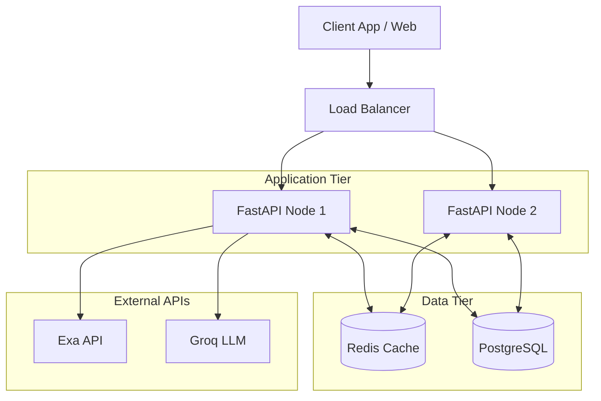

# Enhancement Ideas for AI Travel Planner

This document outlines potential features and architectural improvements that could be added to the AI Travel Planner project with more time. These ideas are great talking points for interviews to demonstrate long-term product vision and engineering maturity.

## 1. Production-Ready State Persistence
**Current State:** The LangGraph workflow uses `MemorySaver()`, which stores state in the server's RAM. If the FastAPI server restarts, all pending travel plans and drafts are lost.
**Enhancement:** Swap `MemorySaver` for `AsyncPostgresSaver` (or another persistent checkpointer like Redis or SQLite). This would allow the Human-in-the-Loop (HITL) process to survive server restarts, enabling a true asynchronous workflow where a user could return days later to approve a plan.

## 2. Real-Time Streaming & UX
**Current State:** API endpoints block until the agent finishes its entire thought process (researching, planning, etc.), which can take 10-20 seconds.
**Enhancement:** Utilize LangGraph's streaming capabilities and FastAPI's Server-Sent Events (SSE). The frontend could listen to these events to show the user exactly what the agent is doing in real-time (e.g., "Searching Exa for attractions...", "Allocating budget...", "Generating packing list..."). This massively improves perceived latency.

## 3. Strict Structured Outputs
**Current State:** The Planner Agent is prompted to return JSON, which is manually parsed using a regex extraction function.
**Enhancement:** Use Pydantic models alongside LangChain's `with_structured_output()` method. This forces the LLM at the API level to return a response matching the exact JSON schema required by the itinerary, drastically reducing the chance of hallucinated fields or broken JSON syntax.

## 4. Parallelizing Agent Tools
**Current State:** The Research Agent calls `web_search` and `get_weather` sequentially. 
**Enhancement:** LangGraph and ReAct agents can be configured to execute independent tools in parallel. Fetching the weather and doing the web search simultaneously would cut the research latency in half.

## 5. User Authentication & Multi-Tenancy
**Current State:** Anyone can hit the `/plan` endpoints, and there is no concept of a "User".
**Enhancement:** Add JWT-based authentication to FastAPI. Tie the LangGraph `thread_id` (currently just `plan_id`) to a specific `user_id`, ensuring that users can only view, approve, or modify their own travel plans.

## 6. Advanced Agent Tools
**Current State:** Tools are basic mock tools or simple API wrappers.
**Enhancement:** 
*   **Flight/Hotel APIs:** Integrate real APIs like Amadeus or Skyscanner to provide actual booking links and live pricing instead of just estimated budget allocations.
*   **Google Maps Integration:** A tool to calculate actual transit times between the generated daily activities to ensure the itinerary is physically possible.

## 7. Target Production Architecture
**Current State:** The application is a monolithic FastAPI server relying on in-memory state, making it impossible to scale horizontally (adding more servers).

**Enhancement:** To make this enterprise-ready, we would transition to a scalable, distributed architecture:

### Key Components:
*   **PostgreSQL (State Persistence):** We would swap `MemorySaver()` with LangGraph's `AsyncPostgresSaver`. PostgreSQL is ACID compliant and would act as the single source of truth for the LangGraph state. Because the state is stored in Postgres, any FastAPI node can handle the `/review` callback and resume the graph, allowing the API tier to scale horizontally.
*   **Redis (Caching & Rate Limiting):** 
    *   **Agent Tool Caching:** We would cache the results of the `get_weather` and `web_search` tools in Redis. If multiple users ask to plan a trip to "Paris in July", we avoid burning Exa API credits and drastically reduce latency by hitting the cache first.
    *   **Rate Limiting:** Redis would be used at the FastAPI layer to prevent API abuse (e.g., limiting users to 5 plan requests per hour).
*   **Load Balancer:** Distributes incoming HTTP requests evenly across multiple containerized FastAPI instances (e.g., running in Kubernetes or AWS ECS).
*   **Background Workers (Celery/RabbitMQ):** Instead of running the LangGraph workflow directly in the FastAPI request thread (which can timeout), we would offload the graph execution to a background queue. The API would return a `202 Accepted` immediately, and the client would connect via WebSockets or Server-Sent Events (SSE) to wait for the draft to be ready.
